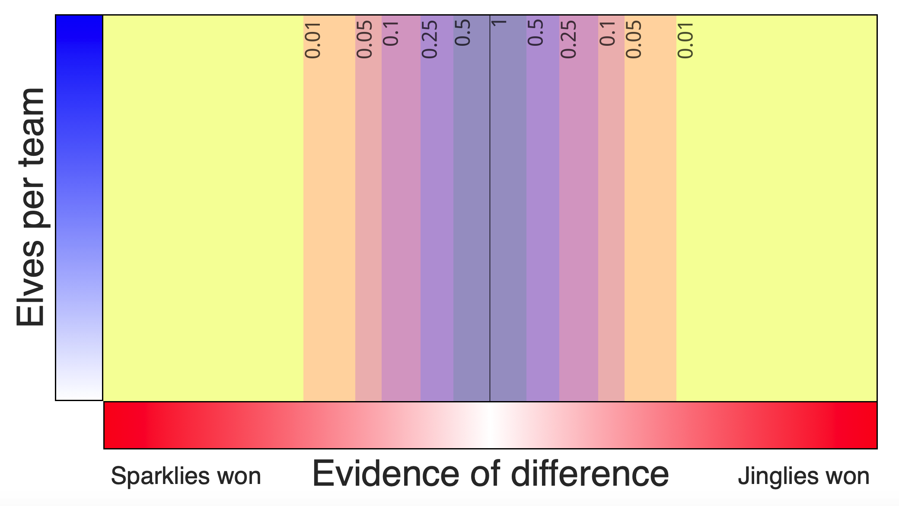
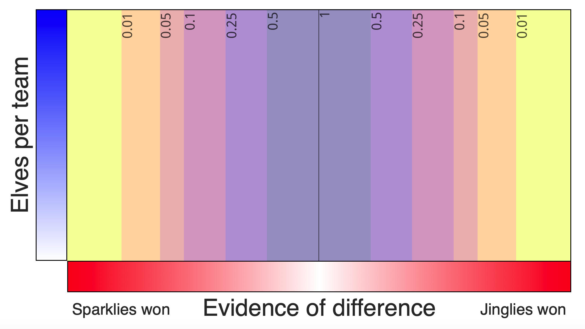

* [Home](index)

------

## Task demonstration

Select parameters for the task below, or leave them at the defaults to be randomly assigned to a condition. The task code is in javascript and will run locally on your computer; no data is sent anywhere. At the end, you will have the option to save your data.

<form action="task.html" method="get">
	Evidence power:
	<select name="q">
  		<option value="">Random</option>
  		<option value="3">3 (wide)</option>
  		<option value="7">7 (narrow)</option>
	</select>
	 
	Toy:
	<select name="toy_name">
  		<option value="">Random</option>
  		<option value="whizbang balls">whizbang balls</option>
  		<option value="constructo bricks">constructo bricks</option>
  		<option value="rainbow clickers">rainbow clickers</option>
  		<option value="doodle noodles">doodle noodles</option>
   		<option value="singing bling rings">singing bling rings</option>
   	  	<option value="brahma buddies">brahma buddies</option>
   	  	<option value="magic colorclay">magic colorclay</option>
   	  	<option value="moon-candy makers">moon-candy makers</option>
	</select>
   
  <input type="submit" value="Go">
</form>

-------

## Task details

In a nutshell, the main task is to determine the sign of an effect, if it is nonzero. 

### Effect sizes

Participants were randomly assigned to one of eight effect size conditions, each with a unique toy name. The sign of the effect was then also randomly assigned (each with 50% probability). Because we were particularly interested in false positives, we assigned participants to the "no effect" condition with greater probability.

|Toy name            | Hidden effect size (δ)| Probability|
|:-------------------|----------------------:|-----------:|
|whizbang balls      |                   0.00|        0.25|
|constructo bricks   |                   0.10|        0.11|
|rainbow clickers    |                   0.19|        0.11|
|doodle noodles      |                   0.30|        0.11|
|singing bling rings |                   0.43|        0.11|
|brahma buddies      |                   0.60|        0.11|
|magic colorclay     |                   0.79|        0.11|
|moon-candy makers   |                   1.00|        0.11|

In the task, participants could sample test statistics at will from either a null distribution (δ=0; called "random shuffle reports") or the "experimental" distribution (with their assigned effect size). 

### Sample sizes

The participants could choose the sample size per "team", but the number was hidden from them. The sample size slider has 20 increments, corresponding to team sizes of 10 to 200. The table below shows the sample sizes, which increased non-linearly as a function of the increment. To induce a resource cost to experimentation, the time a participant had to wait for an experimental sample was proportional to the team size. Null samples were instantaneous.

| n index|   n| Time (s)|
|-------:|---:|--------:|
|       1|  10|        1|
|       2|  12|        2|
|       3|  14|        2|
|       4|  16|        2|
|       5|  19|        2|
|       6|  22|        3|
|       7|  26|        3|
|       8|  30|        3|
|       9|  35|        4|
|      10|  41|        5|
|      11|  48|        5|
|      12|  57|        6|
|      13|  66|        7|
|      14|  78|        8|
|      15|  91|       10|
|      16| 106|       11|
|      17| 125|       13|
|      18| 146|       15|
|      19| 171|       18|
|      20| 200|       20|

When a participant generated a sample, they were generating a test statistic. Hidden from the participant, the underlying test statistic was simply a $Z$ statistic, sampled from the appropriate distribution:

$$ Z \sim \mbox{Normal}(\delta\sqrt{n/2}, 1) $$

where $n$ was determined by the sample size slider selection, and $\delta$ by the participant's randomly assigned effect size (or $\delta=0$ if they are drawing null samples).

However, the participant was not shown the $Z$ statistic.

### Evidence power

The $Z$ statistic was transformed by the following equation, not known to the participant:

$$ x = \mbox{sgn}(Z)\left[1 - \left(1 - F_{\chi_1^2}\left(Z^2\right)\right)^{\frac{1}{q}}\right] $$

The value $x$ gives the location on the experimental "interface" and the color (from left, -1 to right, or 1). The power $q$ was randomly assigned to the participant (3 or 7, with equal probability).

The value $x$ is a monotone transformation of the $Z$ statistic, and hence contains the same information. The value $q$&mdash;called the "evidence power"&mdash;only changes the *visual* effect of the samples. When $q=7$, the visual sampling distribution is narrower on the task interface; when $q=3$, it is wider.

The figure below shows the distributions of the visual evidence ($x$) when $\delta=0.19$ ("rainbow clickers"). Each distribution is a sample size; with increasing sample size, the visual distibution of the test statistic moves further to the right. More extreme values are expected as the sample size increases.

The null distribution (the distribution of the "random shuffle reports") 

<video style="width: 90%" controls>
  <source src="img/double_ani.mp4" type="video/mp4">
</video>
